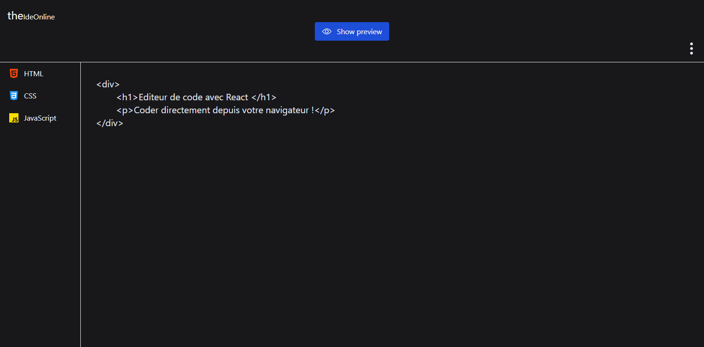
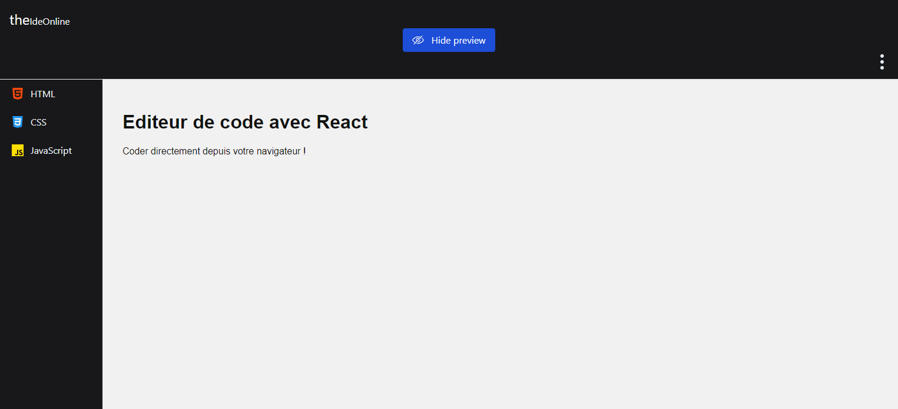

# Ide

Création d'un Ide en ligne où l'on peut visualiser directement dans son navigateur son code HTML, CSS ou même JavaScript.

Technologies utilisées : 
- ReactJS
- React-Redux
- TailWindCss
  
### Sans prévisualisation du code HTML
  
  
 
### Avec prévisualisation du code HTML

